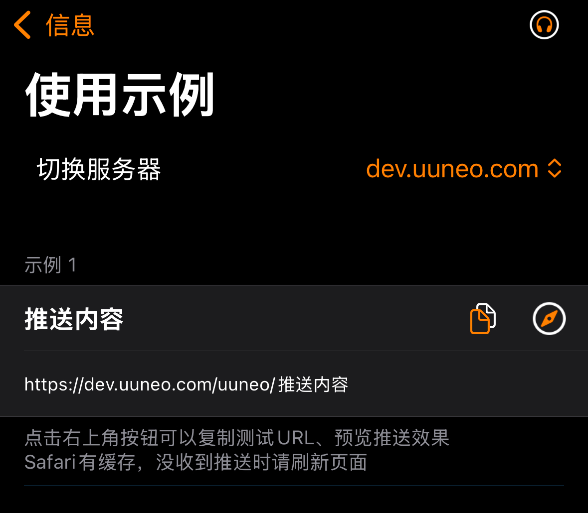

*Thanks to the [BARK](https://github.com/Finb/Bark) open-source project.*

## Sending Push Notifications
1. Open the app and copy the test URL.



2. Modify the content and send a request to this URL.<br>
You can send either a GET or POST request. A successful request will result in an immediate push notification.<br>
Difference from Bark: Parameter priority 【POST > GET > URL params】. POST parameters override GET parameters, and GET parameters override URL parameters accordingly.

## URL Format
The URL consists of a push key, the `title` parameter, and the `body` parameter. There are two combination formats:

```
https://push.uuneo.com/:key/:body 
https://push.uuneo.com/:key/:title/:body 
https://push.uuneo.com/:key/:title/:subtitle/:body

```

## Request Methods
##### GET Request
Parameters are appended to the URL, for example:
```sh
curl https://push.twown.com/your_key/PushContent?group=GroupName&copy=CopyText
```
*When manually appending parameters to the URL, please ensure proper URL encoding. You can refer to [FAQ: URL Encoding](/faq?id=%e6%8e%a8%e9%80%81%e7%89%b9%e6%ae%8a%e5%ad%97%e7%ac%a6%e5%af%bc%e8%87%b4%e6%8e%a8%e9%80%81%e5%a4%b1%e8%b4%a5%ef%bc%8c%e6%af%94%e5%a6%82-%e6%8e%a8%e9%80%81%e5%86%85%e5%ae%b9%e5%8c%85%e5%90%ab%e9%93%be%e6%8e%a5%ef%bc%8c%e6%88%96%e6%8e%a8%e9%80%81%e5%bc%82%e5%b8%b8-%e6%af%94%e5%a6%82-%e5%8f%98%e6%88%90%e7%a9%ba%e6%a0%bc) for more details.*


##### POST Request
Parameters are placed in the request body, for example:
```sh
curl -X POST https://push.twown.com/your_key \
     -d'body=PushContent&group=GroupName&copy=CopyText'
```
##### POST requests support JSON, for example:
```sh
curl -X "POST" "//https://push.twown.com/your_key" \
     -H 'Content-Type: application/json; charset=utf-8' \
     -d $'{
  "body": "Test pushback Server",
  "title": "Test Title",
  "badge": 1,
  "category": "myNotificationCategory",
  "sound": "minuet.caf",
  "icon": "https://day.app/assets/images/avatar.jpg",
  "group": "test",
  "url": "https://mritd.com"
}'
```

##### The JSON request key can be included in the request body, and the URL path must be `/push`, for example:
```sh
curl -X "POST" "https://push.twown.com/push" \
     -H 'Content-Type: application/json; charset=utf-8' \
     -d $'{
  "body": "Test pushback Server",
  "title": "Test Title",
  "device_key": "your_key"
}'
```

## Request Parameters
The list of supported parameters, the specific effects can be previewed in the app.

| Parameter | Bark | Pushback (Compatible with Bark) |
| --------- | ---- | ----------------------------- |
| title | Push Title | |
| subtitle | Push Subtitle | |
| body | Push Content | |
| level | Push interruption level. <br> active: default value, the system will immediately turn on the screen to display the notification. <br> timeSensitive: time-sensitive notification, can be shown even in Do Not Disturb mode. <br> passive: only adds the notification to the notification list, without turning on the screen. <br> critical: important reminder, can remind in Do Not Disturb or silent mode. | The parameter can be replaced with numbers: level=1 <br> 0: passive <br> 1: timeSensitive <br> less than 0: active <br> greater than 2...10: critical. In this mode, the number will be used for volume level= 2...10 |
| volume | Volume level in critical mode, range: 1...10 | No need for this parameter when a number is passed. |
| call | Long reminder, similar to WeChat call notifications | Supports mode=1 for the same effect. |
| badge | Push badge, can be any number | Custom badge must be enabled in the app for it to take effect, otherwise, it will be calculated based on unread notifications. |
| autoCopy | Auto-copy push content for iOS 14.5 and below, for iOS 14.5 and above, long press or swipe down on the notification to copy. | This app is for iOS 16+ |
| copy | Specify the content to be copied when copying the push notification. If this parameter is not provided, the entire push content will be copied. |
| sound | Set different ringtones for the push notification. | Default ringtone can be set in the app. |
| icon | Set a custom icon for the push notification, which will replace the default Bark icon. <br> The icon will be automatically cached locally, and the same icon URL will only be downloaded once. |
| image | Provide an image URL, the phone will automatically download and cache the image upon receiving the message. | The image can be viewed in the notification dropdown or in the app. <br> After renaming locally, it can be used directly with <icon=local name>. |
| video | <font color='red'>Not supported yet</font> | Provide a video URL, and the phone can pull down and watch the video after receiving the message. |
| group | Group the messages, the push notifications will be displayed in the notification center according to the group. <br> You can also choose to view different groups in the historical message list. |
| isArchive | Pass 1 to save the push notification, pass other values to not save the push, or leave it unspecified to decide based on app settings. |
| url | The URL to redirect to when clicking the push notification. Supports URL Scheme and Universal Link. |
