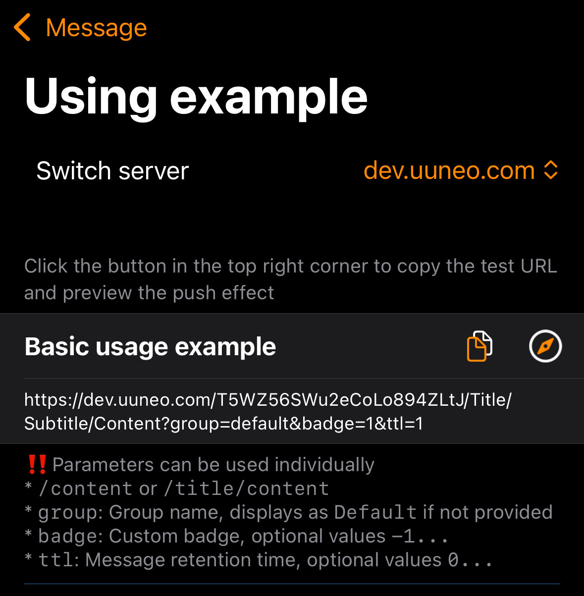

*オープンソースプロジェクト [BARK](https://github.com/Finb/Bark) に感謝します。*

## プッシュ通知の送信
1. アプリを開き、テストURLをコピーします。



2. コンテンツを変更し、このURLにリクエストを送信します。<br>
GETまたはPOSTリクエストを送信できます。リクエストが成功すると、即座にプッシュ通知が送信されます。<br>
Barkとの違い: パラメータの優先順位 【POST > GET > URLパラメータ】。POSTパラメータはGETパラメータを上書きし、GETパラメータはURLパラメータを上書きします。

## URLフォーマット
URLはプッシュキー、`title`パラメータ、`body`パラメータで構成されます。以下の2つの組み合わせフォーマットがあります：

```
https://push.uuneo.com/:key/:body 
https://push.uuneo.com/:key/:title/:body 
https://push.uuneo.com/:key/:title/:subtitle/:body

```

## リクエスト方法
##### GETリクエスト
パラメータはURLに追加されます。例：
```sh
curl https://push.uuneo.com/your_key/PushContent?group=GroupName&copy=CopyText
```
*パラメータを手動でURLに追加する場合は、適切なURLエンコーディングを確保してください。[FAQ: URLエンコーディング](/faq?id=%e6%8e%a8%e9%80%81%e7%89%b9%e6%ae%8a%e5%ad%97%e7%ac%a6%e5%af%bc%e8%87%b4%e6%8e%a8%e9%80%81%e5%a4%b1%e8%b4%a5%ef%bc%8c%e6%af%94%e5%a6%82-%e6%8e%a8%e9%80%81%e5%86%85%e5%ae%b9%e5%8c%85%e5%90%ab%e9%93%be%e6%8e%a5%ef%bc%8c%e6%88%96%e6%8e%a8%e9%80%81%e5%bc%82%e5%b8%b8-%e6%af%94%e5%a6%82-%e5%8f%98%e6%88%90%e7%a9%ba%e6%a0%bc) を参照してください。*

##### POSTリクエスト
パラメータはリクエストボディに配置されます。例：
```sh
curl -X POST https://push.uuneo.com/your_key \
     -d'body=PushContent&group=GroupName&copy=CopyText'
```
##### POSTリクエストはJSONをサポートします。例：
```sh
curl -X "POST" "//https://push.uuneo.com/your_key" \
     -H 'Content-Type: application/json; charset=utf-8' \
     -d $'{
  "body": "Test pushback Server",
  "title": "Test Title",
  "badge": 1,
  "category": "myNotificationCategory",
  "sound": "minuet.caf",
  "icon": "https://day.app/assets/images/avatar.jpg",
  "group": "test",
  "url": "https://mritd.com"
}'
```

##### JSONリクエストキーはリクエストボディに含めることができ、URLパスは`/push`でなければなりません。例：
```sh
curl -X "POST" "https://push.uuneo.com/push" \
     -H 'Content-Type: application/json; charset=utf-8' \
     -d $'{
  "body": "Test pushback Server",
  "title": "Test Title",
  "device_key": "your_key"
}'
```

## リクエストパラメータ
サポートされているパラメータのリスト。具体的な効果はアプリ内でプレビューできます。

| パラメータ | Bark | Pushbackの使用上の違い |
| --------- | ---- | ---------------------- |
| id | なし | UUIDを渡して同じidで既存のメッセージを上書き |
| title | プッシュ通知のタイトル | 同じ |
| subtitle | プッシュ通知のサブタイトル | 同じ |
| body | プッシュ通知の内容 | 同じ markdownを送信する場合はcategory=markdownが必要 |
| level | プッシュ通知の割り込みレベル。<br>**active**: デフォルト、システムは即座に画面を点灯して通知を表示します。<br>**timeSensitive**: 時間に敏感な通知、集中モード中でも表示されます。<br>**passive**: 通知リストに追加され、画面は点灯しません。<br>**critical**: 重要な通知、集中モードやサイレントモード中でも表示されます。 | 互換性あり。パラメータは数字で置き換え可能：`level=1`<br>0: passive<br>1: active<br>2: timeSensitive<br>3...10: critical（数字は音量を表す、`level=3...10`）。 |
| volume | クリティカルモード通知の音量レベル。範囲：0...10 | 同じ |
| call | 長い通知、WeChatの通話通知に似ています | 同じ |
| badge | プッシュ通知のバッジ、任意の数字を設定可能 | アプリ内でカスタムバッジを有効にする必要があります。それ以外の場合、未読数に基づいて計算されます。 |
| autoCopy | iOS 14.5以下ではプッシュ内容を自動的にコピーします。iOS 14.5以上では、通知を長押しまたは引き下げる必要があります。 | このアプリではiOS 16+でのみ利用可能です。 |
| copy | プッシュ通知をコピーする際にコピーする内容を指定します。指定されていない場合、プッシュ内容全体がコピーされます。 | 同じ |
| sound | プッシュ通知のカスタムサウンドを設定します。 | デフォルトのサウンドはアプリ内で設定可能です。 |
| icon | プッシュ通知のカスタムアイコンを設定します。カスタムアイコンはデフォルトのBarkアイコンを置き換えます。<br>アイコンは自動的にローカルにキャッシュされ、同一のURLは一度だけダウンロードされます。 | 互換性あり |
| image | 通知を受信した際にダウンロードおよびキャッシュされる画像のURL。 | 通知を引き下げるか、アプリ内で画像を表示可能。<br>ローカルで名前変更された画像は、`icon=local_name`で直接使用可能。 |
| group | 指定された値で通知をグループ化します。通知センターでグループ化され、履歴リストでフィルタリング可能です。 | 互換性あり |
| isArchive | `1`で通知を保存、それ以外の値で破棄。指定されていない場合、アプリの設定に従います。 | `ttl=days`を使用。指定されていない場合、アプリの設定が使用されます。 |
| url | プッシュ通知をクリックした際に開くURL。URLスキームおよびユニバーサルリンクをサポートします。 | 同じ |
